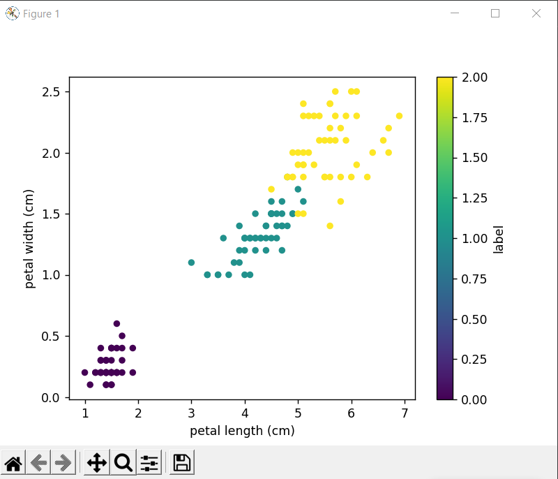
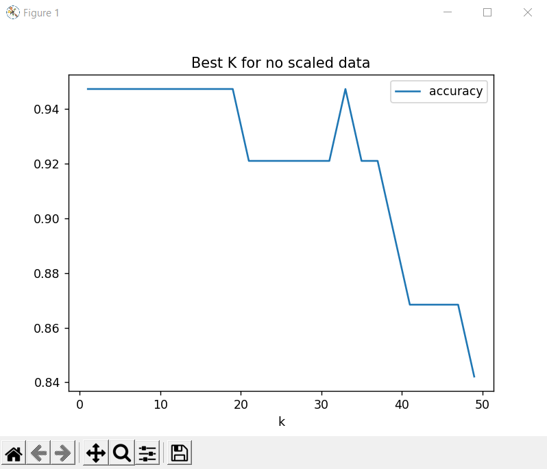
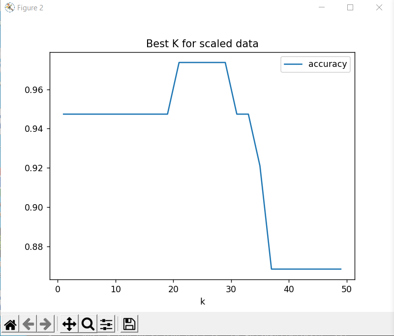
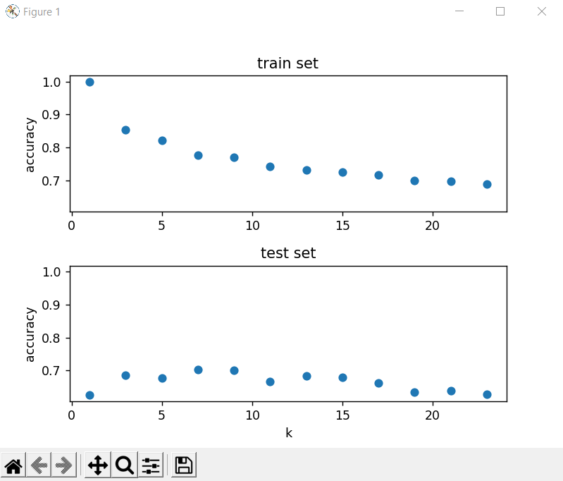
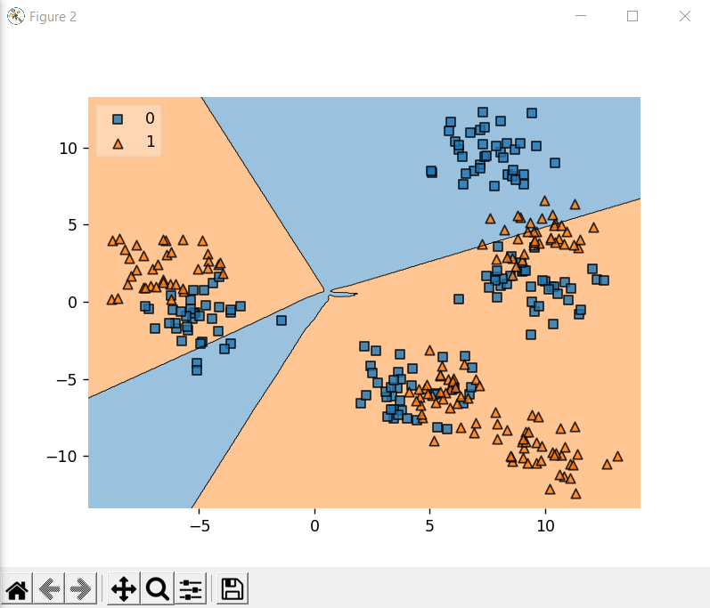

# Iris Dataset (KNN Classificator)
Visualize Dataset

Visualize K for no scaled data

Visualize K for scaled data

    The best k = 15 , score = 97.36842105263158
# Sythetic Dataset

Visualize k for test and train 

Visualize decision boundary

    The best k = 9 , score = 92.0