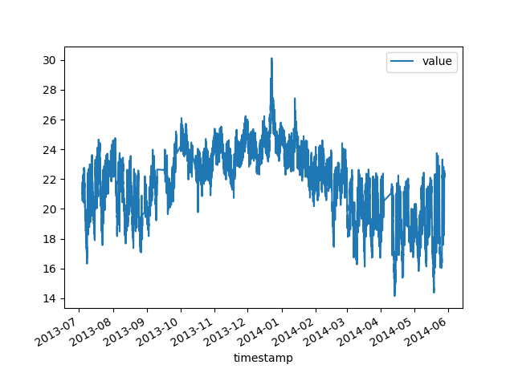
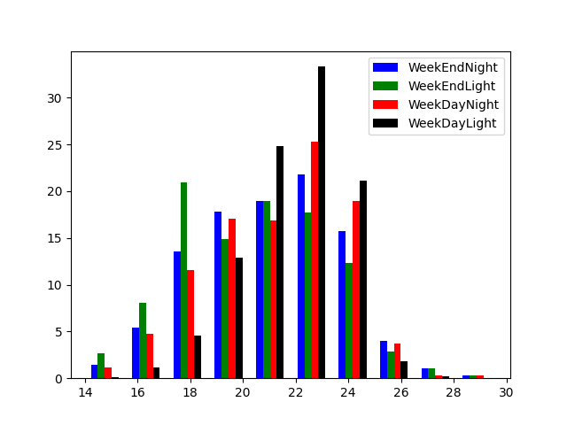
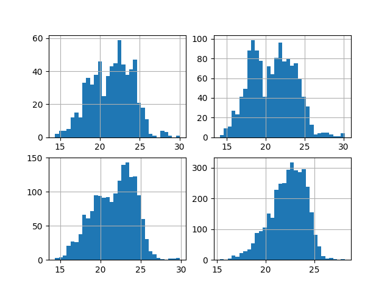
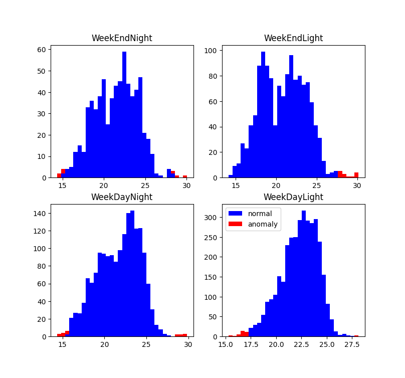
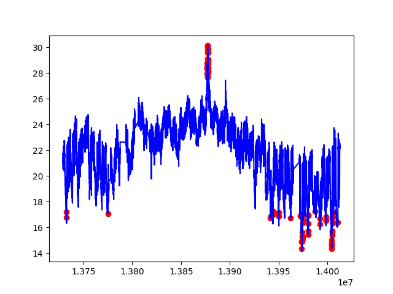
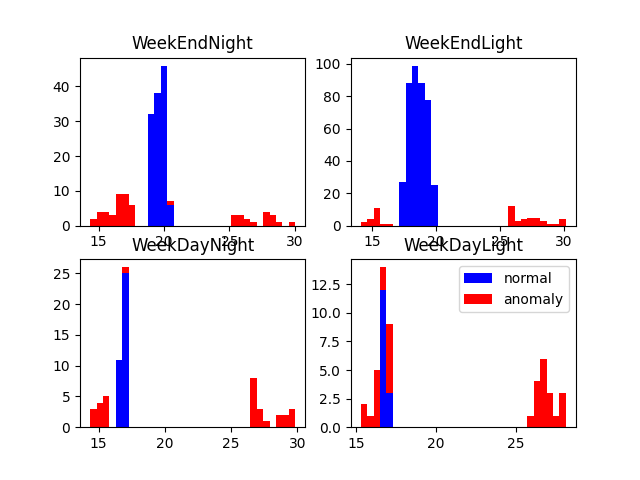
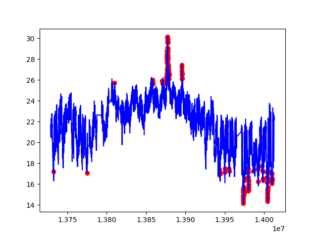
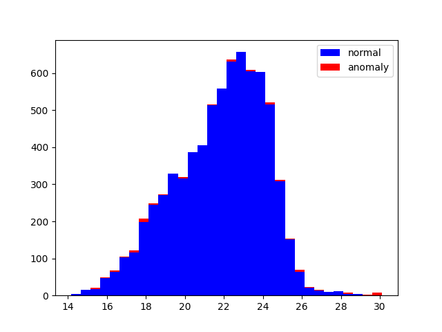
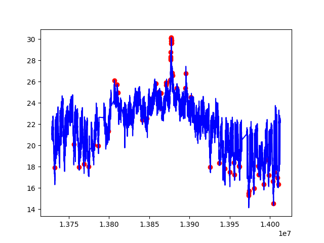
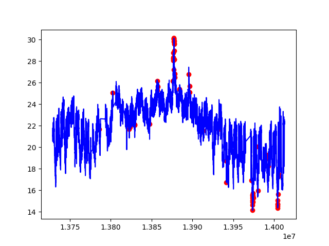

# Dataset 

 Датасет був обраний <a href="https://www.kaggle.com/datasets/boltzmannbrain/nab"> тут </a>
 
 У проекті було використано лише realKnowCause/ambient_temperature_system_failure.csv
 - ambient_temperature_system_failure.csv: температура навколишнього середовища в офісі.

# Elliptic Envelope 

У цьому способі ми розділи данні на 4 категорії 

Поділили значення на вихідні і будні дні та на день і ніч

Візуалізація данних за розподілом часу

# DBSCAN

Без розподілу на 4 категорії цей метод не працює корректно тому тут ми теж розділимо на декілька категорії

# Isolation Forest
Використовуємо для пошуку колективних аномалій (невпорядкованих).
Простий, добре працює з різними розподілами даних і ефективний з даними великого розміру.

Розподіл за температурою

Розподіл за часом 

# One SVM 

Добре підходить для виявлення новизни (відсутність аномалій у наборі тренувальному сеті). Цей алгоритм добре працює для мультимодальних даних.

