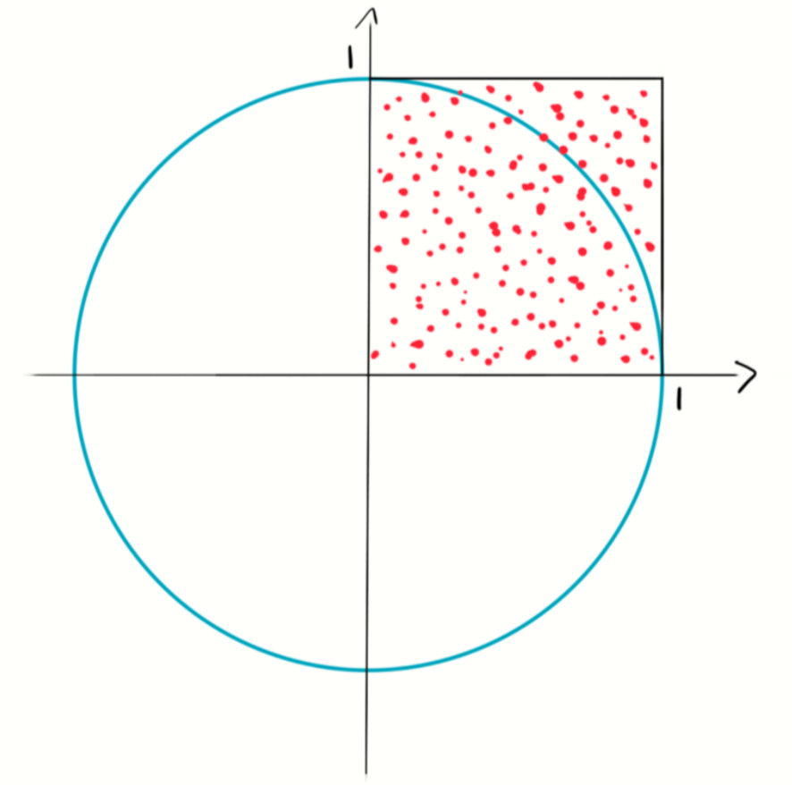

# Математичне пояснення для першого завдання
Мета завдання заповнити данний квадрант точками і обчислити значення pi
відносно усіх точок до точок розташованих у межах кола.
В данному випадку цей квадрант це лише 1/4 кола

Площа квадрату це: 1+1 = 1
А площа кругового квадранту обчисляється за формулою:
(pi * (r^2)) / 4

Тепер ми можемо обчислити значення pi зробивши просте співвідношення
Площа квадратну це всі точки які опинились в межах кола з радіусом 1
pi = 4 * (кількість точок у колі/кількість точок у квадраті) 

