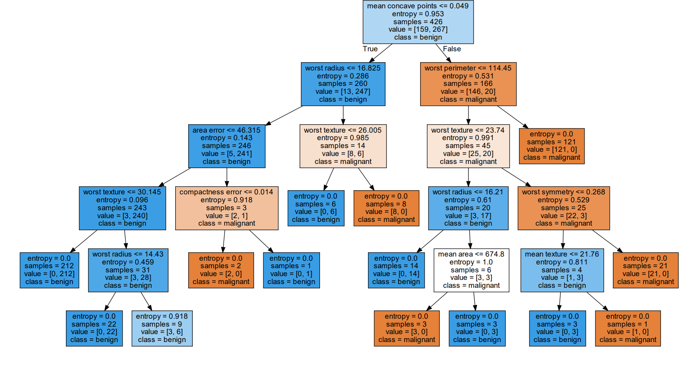
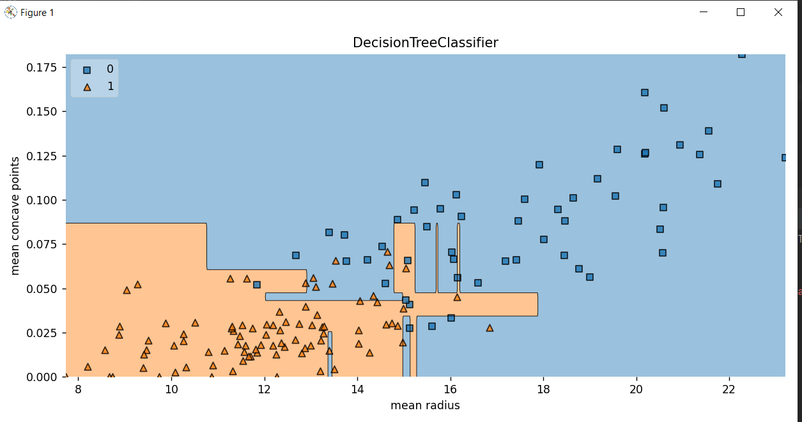
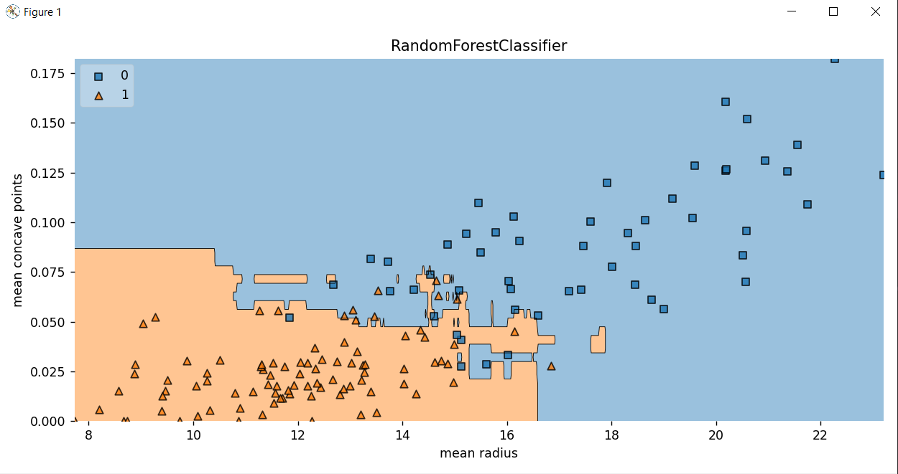
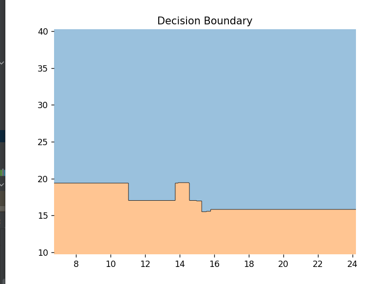
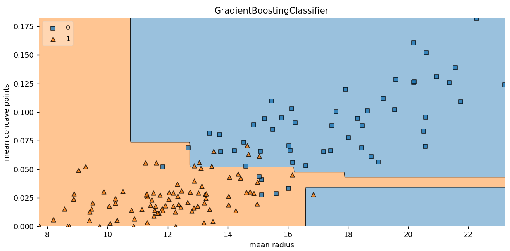

# Decision Tree

    train accuracy= 99.296%
    test accuracy= 95.105%

  <h3> Tree </h3>

<h3> Decision Boundary </h3>

# Random Forest
    
    depth = 7
    train accuracy= 100.000%
    test accuracy= 98.601%

<h3>Decision Boundary</h3>

# Gradient Boosting
    train accuracy= 98.826%
    test accuracy= 95.804%

<h3>Decision Tree</h3>

