# Exploratory Data Analysis

<h3>Correlation Matrix</h3>

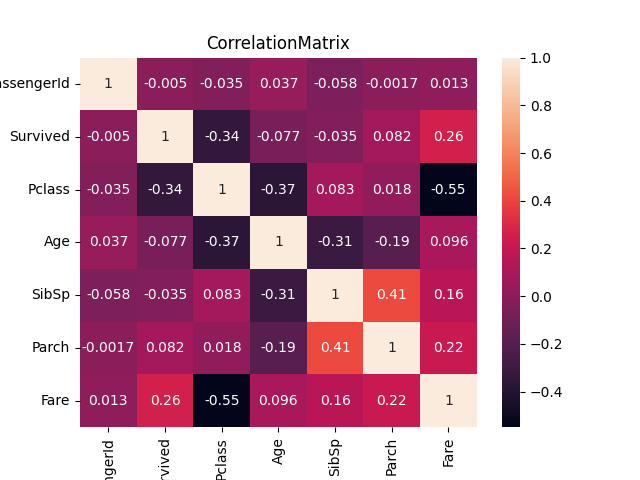

   Як бачимо кореляційна матриця не відображеє всіх данних тому що вони не є числами.
   Наприклад стать у нас записана як "male" i "female", та інші данні які варто було б перетворити в числа для відображення на цьому графіку.
   
   Але перш ніж робити подібні маніпуляції можемо графічно відобразити кожну змінну аби прояснити їх значимість.
   
# Опис значень 
- PassangerId  - ід пасажира(ігноруємо)
- Pclass - класс квитка
- Age - вік пасажира 
- Sex - стать
- Sibsp - кількість братів і сестер на борту
- Parch - кількість батьків на борту чи дітей
- Ticket - номер квитка (ігноруємо)
- Fare - Тариф пасажира 
- Cabin - номер каюти ? Чому тоді деякі пасажири не мають номеру каюти ?
- Embarked - Порт посадки

# Графічне дослідження

<h3>Pclass</h3>

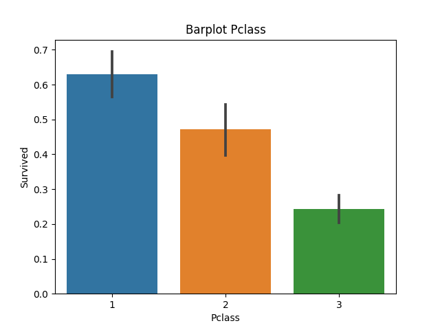
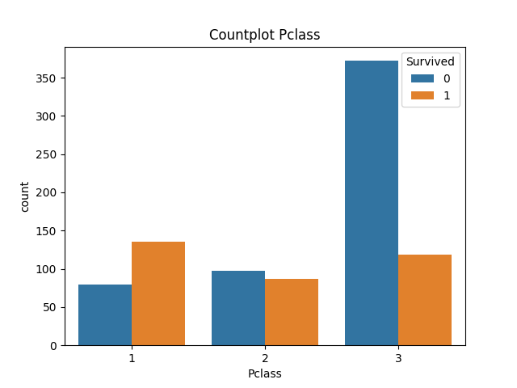

Значення Pclass на кореляційній матриці цілком виправдане, адже чим нижчий(вищий?) класс пассажира тим більше у нього шансів на виживання

<h3>Name</h3>
 Ім"я пасажира будемо ігнорувати так як очевидно що важливої ролі не відіграє

<h3> Sex </h3>

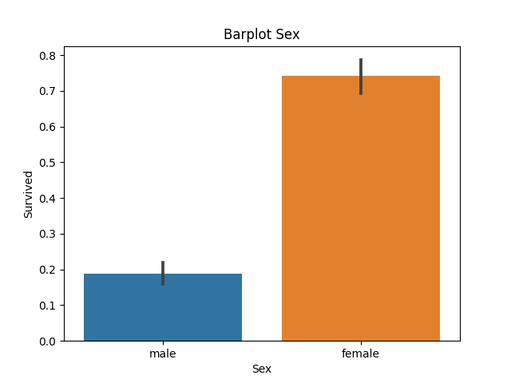
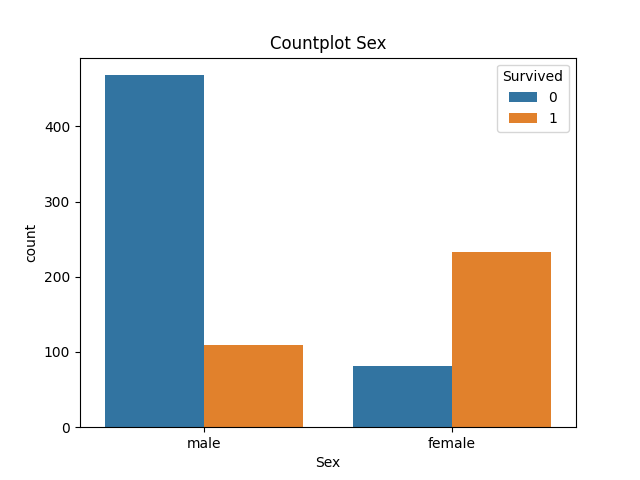

З данних графіків можна зробити сміливе припущення, що жінки мають набагато більше шансів вижити.
Отже стать це одна з ключових фіч для прогнозування.

<h3> Age</h3>

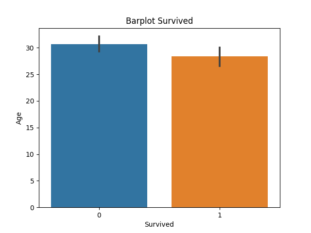
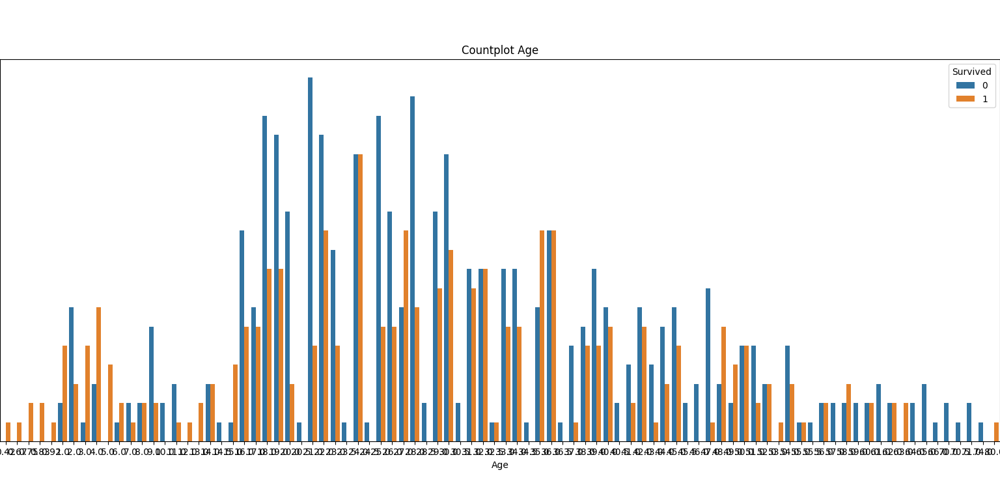

Немовлята і діти мають дещо більший шанс на виживання порівняно з дорослими особами

<h3> SibSp </h3>

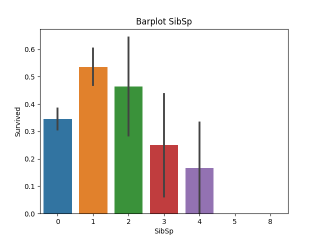
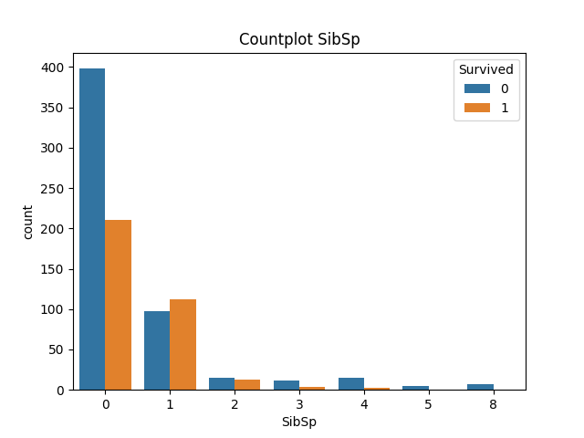

Люди в кого декілька (1-2) систер чи братів мають трішки більше шансів на виживання

<h3> Parch </h3>

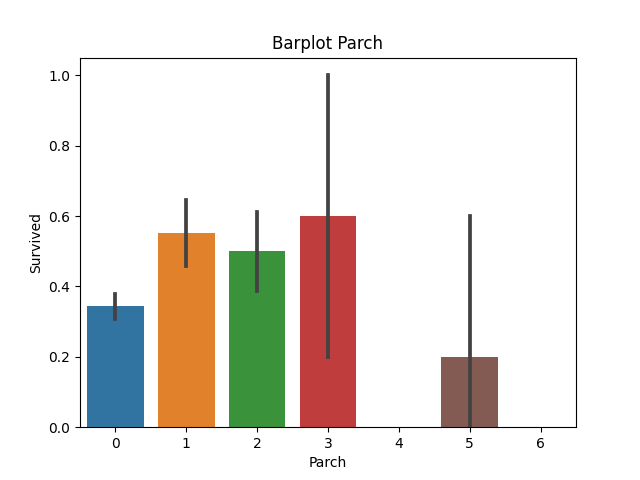
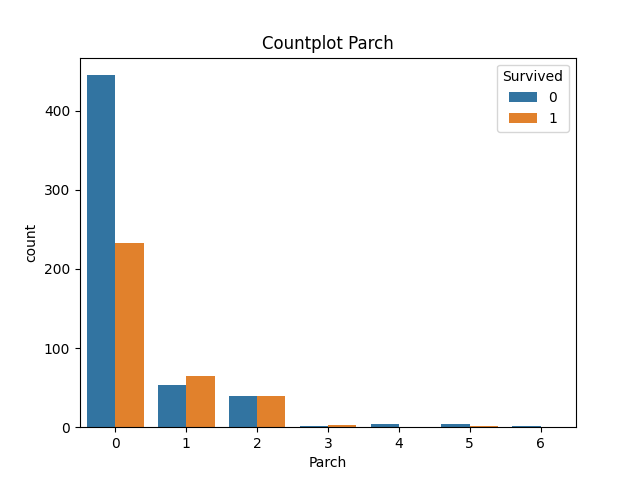

Важко тут замітити якісь сильні змінні відмінності(1,2,3). Варто виділити лише те, що якщо в вас немає дітей чи батьків на борту то шанси вижити спадають

<h3> Ticket </h3>

   Унікальний номер квитка, абсолютно не впливає на шанс вижити.

<h3> Fare </h3>

Чим вищий тариф тим більше шансів вижити

<h3> Cabin </h3>

   Номер каюти немає важливого впливу на виживання, можливо мала б вплив інформація про розташування каюти
   Наприклад каюти з в діапазоні (1-20(ігноруючи номер палуби)), мали б більше шансів на виживання.
   Але поки опустимо цей момент.

<h3> Embarked </h3>

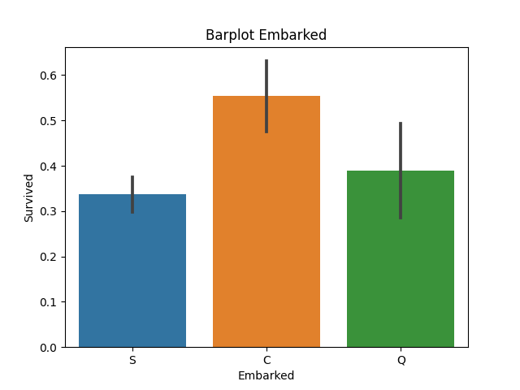
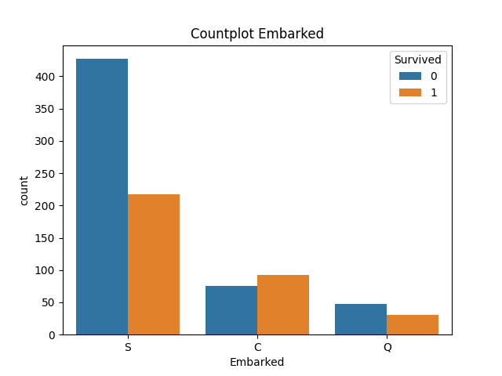

 Ті хто мали місце посадки С мають більше шансів на виживання.
 

# Основні фічі
 - Fare
 - Embarked
 - Pclass
 - Sex
 - Age
 - Parch
 - SibSp

# Вибір моделі

На основі <a href="model_analyse.md">аналізу роботи декількох моделей</a>

Виберемо GradientBoost i RandomForest

