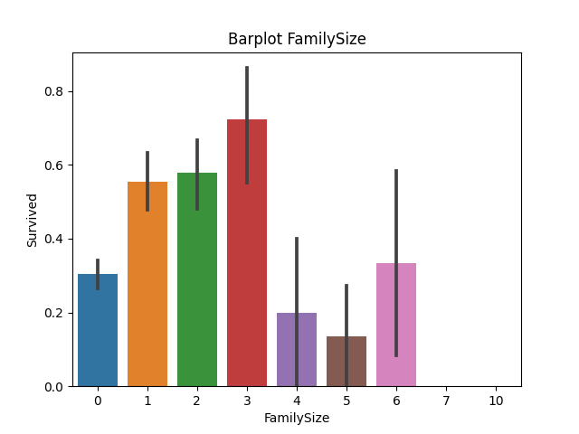
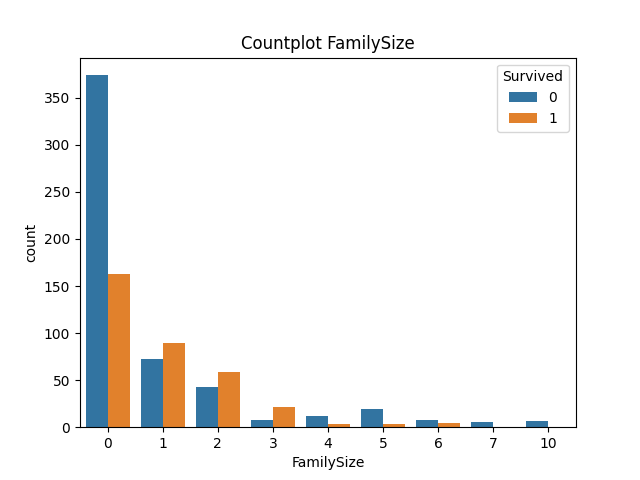
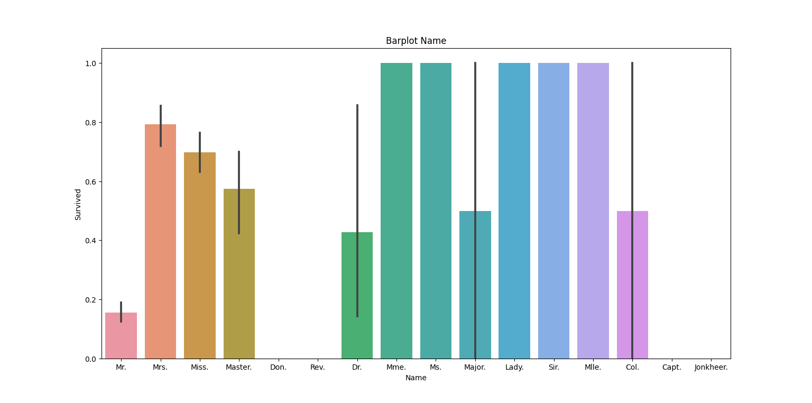
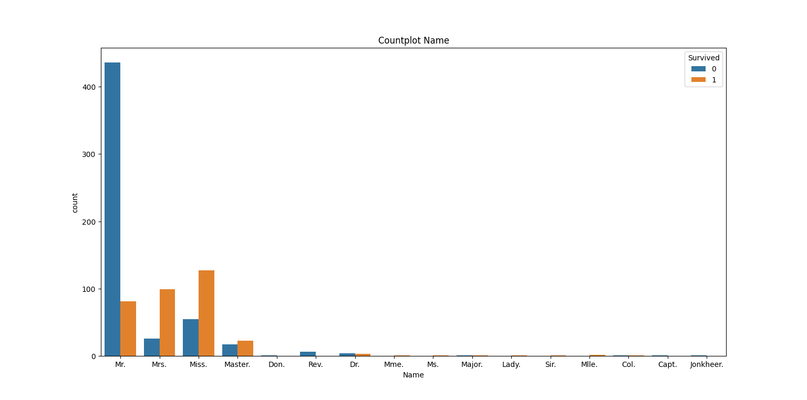

# Спроби підвищення точності мережі через змінну параметрів моделі

Оскільки тільки для моделі RandomForest вдалось підняти середню точність мережі 
на ~ 1.5 % за допомогою зміни параметра n_estimators на 150 (кількість дерев в лісі Default = 100) то будемо використовувати для майбутнього прогнозування саме цю модель

# Додатковий дата аналіз

Кількість членів сімї

Як разом впливає кількість членів сімї на борту на шанси на виживання ?
Тобто загальна кількість батьків+братів.

Як можна помітити на графіку то шанси на виживання все-таки залежать від 
кількості членів сімї набагато сильніше ніж здавалось (судячи по графікам SibSp, Parch)

Спробуємо додати нову фічу.
    
    Depth:  5
    train accuracy= 84.581%
    test accuracy= 84.753%
    Depth:  6
    train accuracy= 86.826%
    test accuracy= 84.753%
    Depth:  7
    train accuracy= 89.521%
    test accuracy= 85.650%
    Depth:  8
    train accuracy= 91.617%
    test accuracy= 86.099%
    Depth:  9
    train accuracy= 92.515%
    test accuracy= 84.753%
    Depth:  10
    train accuracy= 94.012%
    test accuracy= 86.099%

Запустивши декілька разів навчання ми стали частіше наближатися до відмітки в 86%

# Name 

Можливо імена не такі вже і безкорисні як ми думали на початку.
В кожного пасажира є своя приставка в імені:  

    Mr.          517
    Miss.        182
    Mrs.         125
    Master.       40
    Dr.            7
    Rev.           6
    Col.           2
    Mlle.          2
    Major.         2
    Don.           1
    Lady.          1
    Jonkheer.      1
    Capt.          1
    Ms.            1
    Sir.           1
    Mme.           1

І лише один пасажир немає такої приставки(Дамо йому приставку Mr. - так як найбільше на кораблі):

    Survived        0
    Pclass          0
    Name            1
    Sex             0
    Age           177
    SibSp           0
    Parch           0
    Ticket          0
    Fare            0
    Cabin         687
    Embarked        2
    FamilySize      0

Спробуємо відобразити ці данні на графіку

Як можемо помітити що деякі люди мають практично гарантовані шанси на виживання
наприклад Lady, Sir 
Результати тренування:

    Depth:  5
    train accuracy= 84.132%
    test accuracy= 88.789%
    Depth:  6
    train accuracy= 86.527%
    test accuracy= 88.789%
    Depth:  7
    train accuracy= 89.371%
    test accuracy= 87.892%
    Depth:  8
    train accuracy= 91.467%
    test accuracy= 88.341%
    Depth:  9
    train accuracy= 92.665%
    test accuracy= 88.341%
    Depth:  10
    train accuracy= 93.413%
    test accuracy= 88.341%

Як бачимо точність вдалось трохи більше покращити

