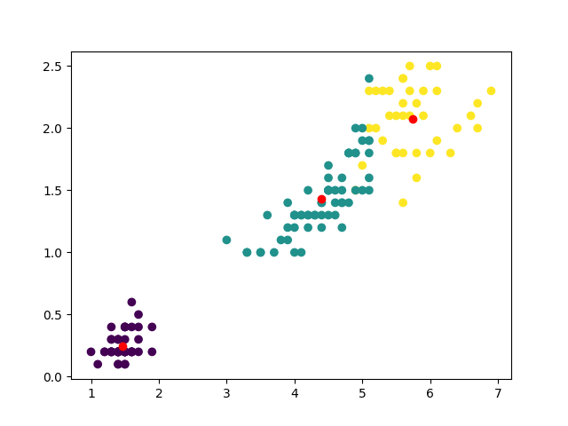
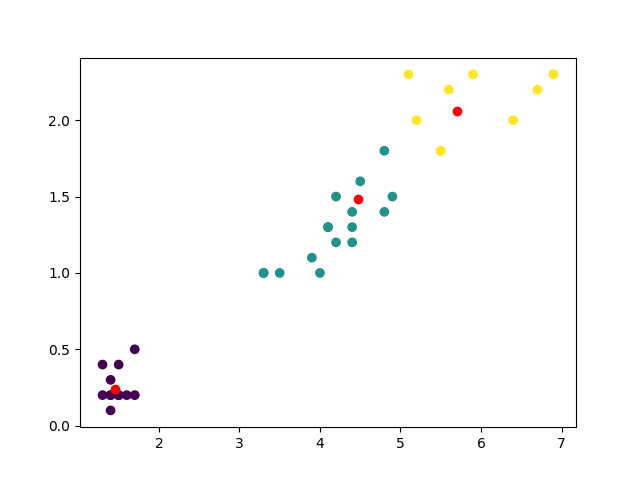

# Use Kmeans for Iris

3 clusters

Score:

    Train:
    0.8933333333333333

Split Data on train and test:

Score:

    Train: 0.8571428571428571
    Test:  0.9736842105263158
    
Score for scaled data:

    Train: 0.9821428571428571
    Test:  0.9736842105263158
