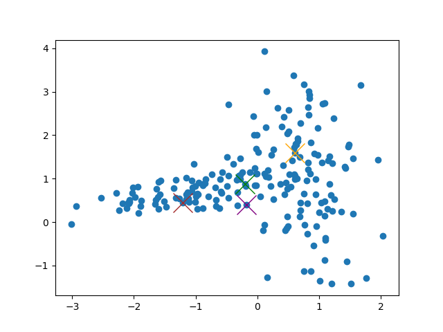
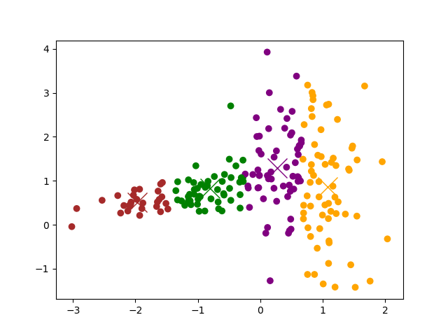
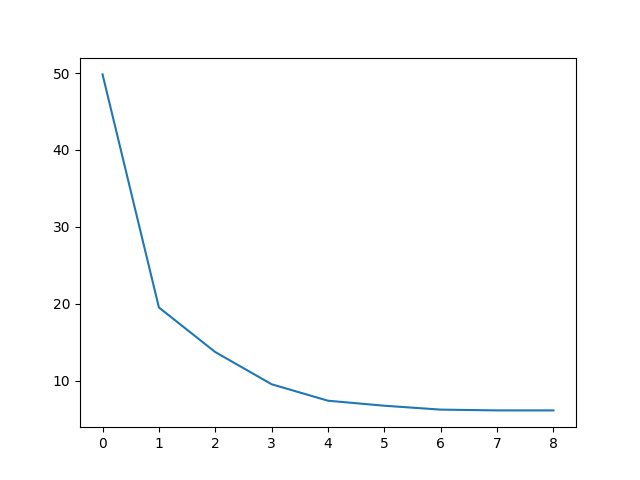

# Manual Kmeans: The best clastering

Random centroids 

Centroids in the end:

Cost func:

Output

    ...
    95
    96
    97
    98
    99
    Lowest cost
    6.125479438197845

<a href="Sklearn_clustering.md"> See also my Sklearn solutions </a>
 
<a href="Iris.md"> See also my Kmeans for Iris solutions </a>

