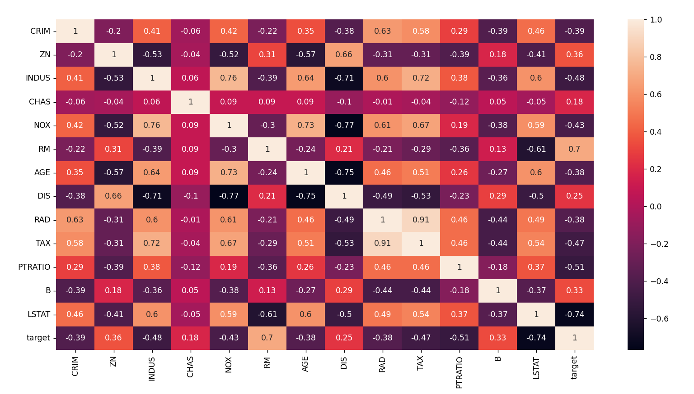
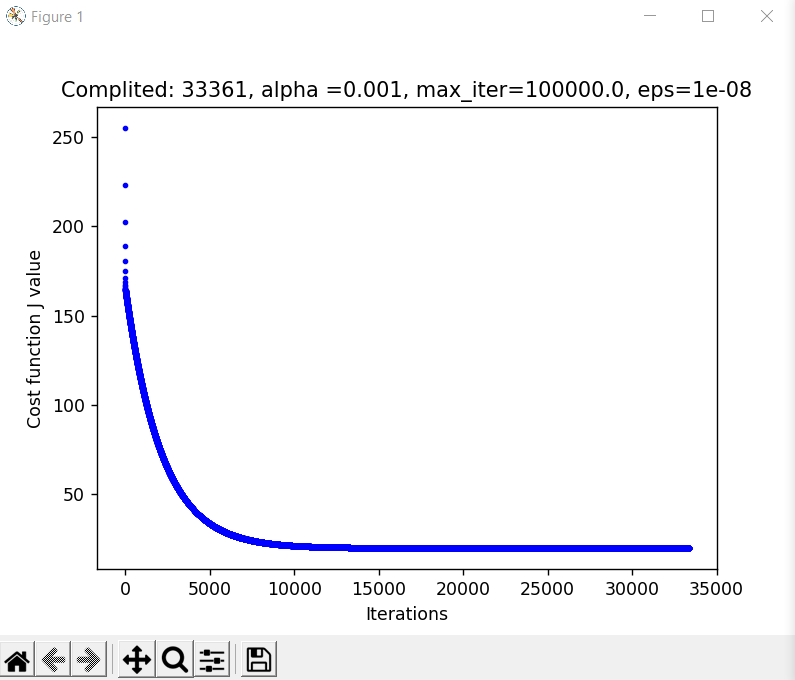
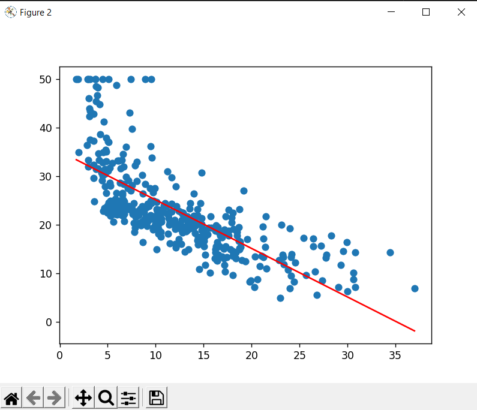
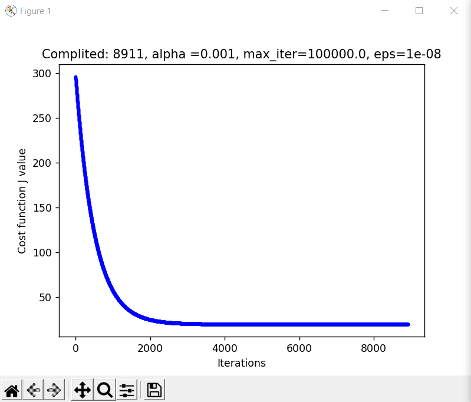
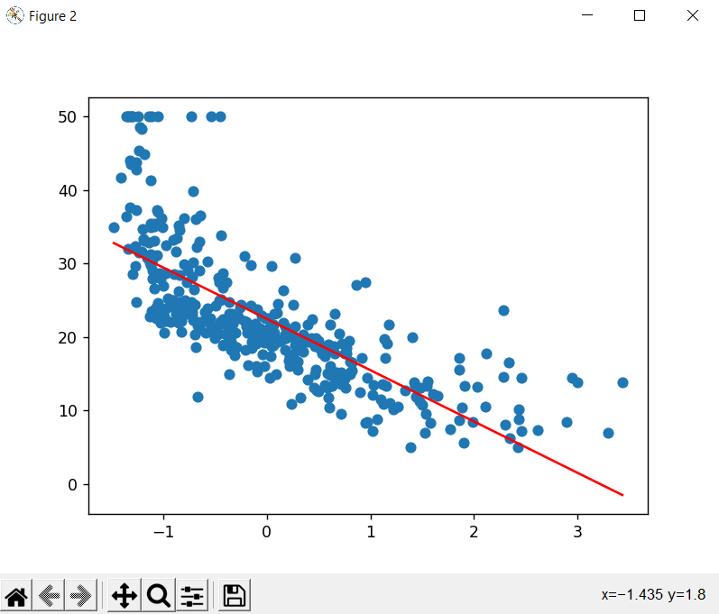

# Linear regression 
- Вибір фічі яка відповідає RM
- На кореляційний матриці видно що RM має коефіцієнт 0.7, отже відповідним до нього буде поле LSTAT з коефіцієнтом -0.74

# No scaled Data

# Scaled Data

    R2 Score = 0.5922469604178708
    b: 22.355527899999995, w= [[-6.4487427]]