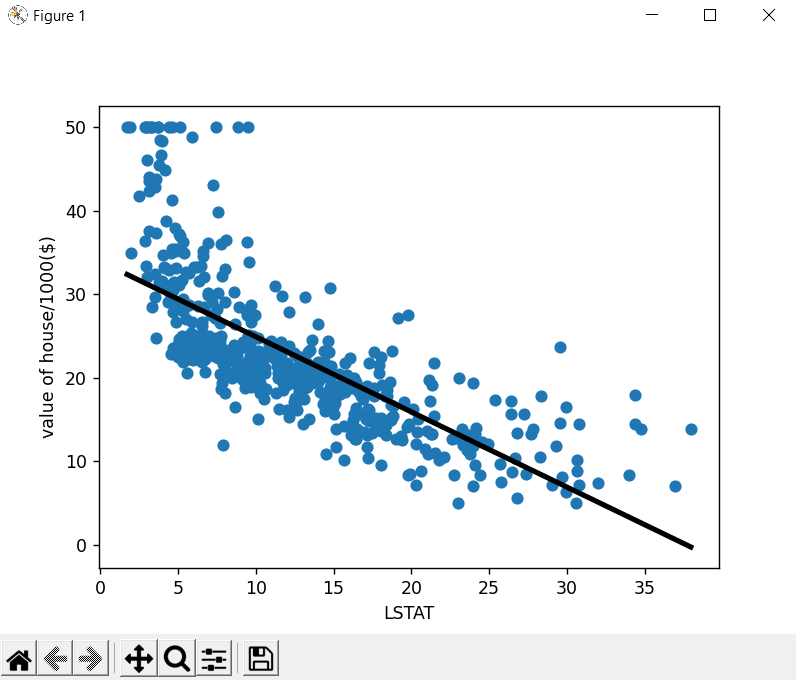
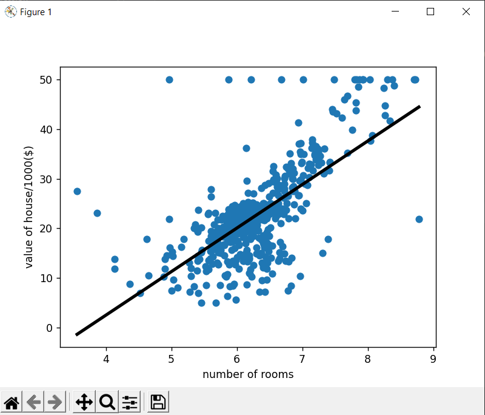
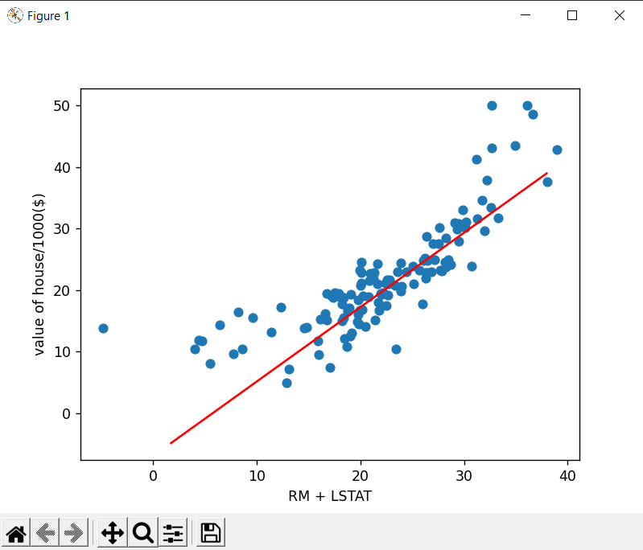
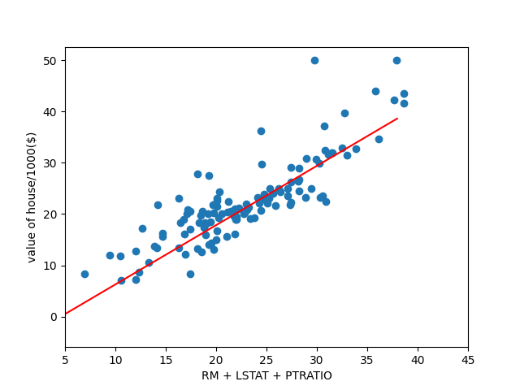

# Sklearn linear regression boston dataset
- Realize only one feature ("LSTAT") 

- Realize only one feature ("RM")

# Regression with 2 Features (RM + LSTAT)

# Regression with 3 Features (RM + LSTAT _ PTRATIO)

    Linear Regression
    R2 train score = 0.6244330693994584
    R2 test score = 0.6653760843303117
    b: [22.23641161], 
    w= [[ 3.28844233 -4.56393088]]
    Score:  0.6653760843303117
1) The model explains, 67.1 % variance of the target w.r.t features is
2) The Mean Absolute Error of model is: 3.91
3) The R-Square score of the model is  0.67