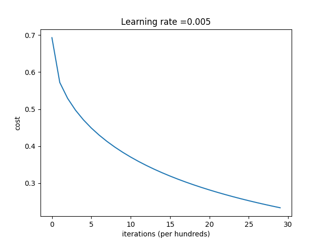
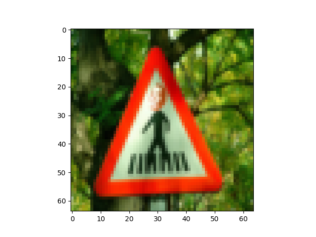
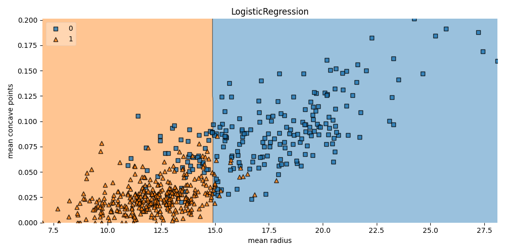

# Manual Non-Cat Classificator

    Cost after iteration 0: 0.693147
    Cost after iteration 100: 0.571977
    Cost after iteration 200: 0.528957
    Cost after iteration 300: 0.497042
    Cost after iteration 400: 0.471093
    Cost after iteration 500: 0.449030
    Cost after iteration 600: 0.429769
    Cost after iteration 700: 0.412656
    Cost after iteration 800: 0.397258
    Cost after iteration 900: 0.383269
    Cost after iteration 1000: 0.370460
    Cost after iteration 1100: 0.358659
    Cost after iteration 1200: 0.347727
    Cost after iteration 1300: 0.337555
    Cost after iteration 1400: 0.328052
    Cost after iteration 1500: 0.319144
    Cost after iteration 1600: 0.310767
    Cost after iteration 1700: 0.302869
    Cost after iteration 1800: 0.295403
    Cost after iteration 1900: 0.288331
    Cost after iteration 2000: 0.281618
    Cost after iteration 2100: 0.275233
    Cost after iteration 2200: 0.269152
    Cost after iteration 2300: 0.263349
    Cost after iteration 2400: 0.257804
    Cost after iteration 2500: 0.252499
    Cost after iteration 2600: 0.247417
    Cost after iteration 2700: 0.242542
    Cost after iteration 2800: 0.237862
    Cost after iteration 2900: 0.233364
    train accuracy= 96.172%
    test accuracy= 74.000%

Prediction by single image:

    y_predicted = 0.0 (true label = 0) , you predicted that it is a 0.0 picture.

0 - means it's non cat image

# SKLearn solutions for NoCatClassificator

    X_train.shape=  (209, 64, 64, 3)
    X_test.shape=  (50, 64, 64, 3)
    Y_train.shape=  (209, 1)
    Y_test.shape=  (50, 1)
    train_set_x_flatten shape: (209, 12288)
    test_set_x_flatten shape: (50, 12288)
    sanity check after reshaping: [17 31 56 22 33]
    train accuracy= 90.909%
    test accuracy= 66.000%

# Logistic Regression for Breast Cancer Dataset

    Breast cancer dataset
    X_cancer.shape= (569, 2)
    Accuracy of Logistic regression classifier on training set: 0.88
    Accuracy of Logistic regression classifier on test set: 0.88

Decision boundary

