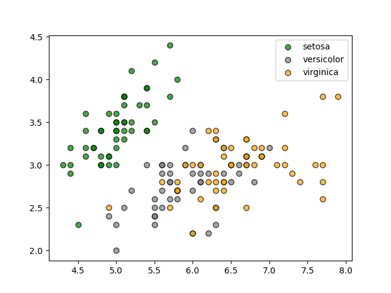
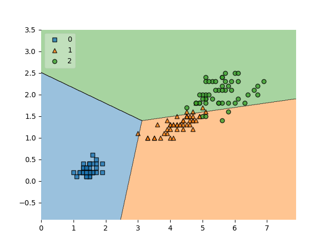
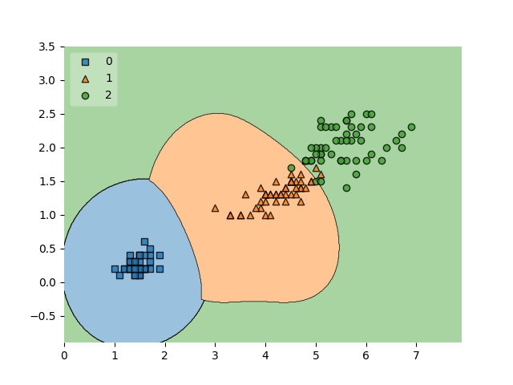
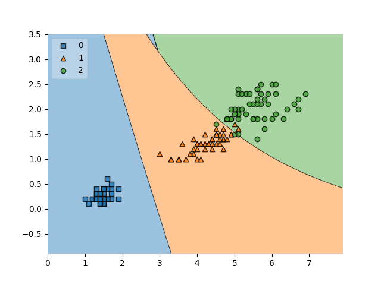

# Linear SVM

<h3> Iris Scatter </h3>

<h3> Decision Boundary </h3>

    SVM Linear Kernel
    train accuracy= 94.000%
    b = [ 2.12826476 -1.13614193 -4.17110867]
    w = [[-0.61570849 -0.81021916]
     [ 0.58375891 -1.15661667]
     [ 0.28015204  1.70097634]]
# SVM RBF

    SVM RBF Kernel
    train accuracy= 96.667%
    b = [-0.24780899 -0.3217858  -0.15068605]

# Polynomial SVM 

    SVM Polynomial Kernel
    train accuracy= 96.667%
    b = [1.5080124  1.13480215 6.91775551]