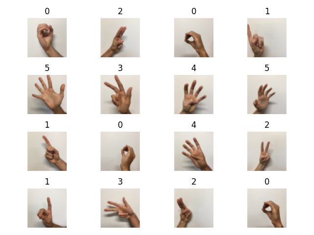
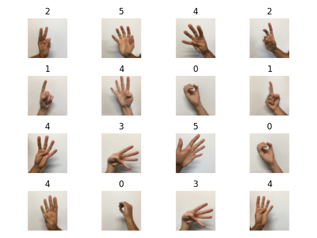

# Train set 

# Test prediction 

Breast Cancer output:

    train accuracy= 99.061%
    test accuracy= 97.902%
    X_train.shape= (1080, 64, 64, 3)
    X_test.shape= (120, 64, 64, 3)
    y_train.shape= (1080,)
    y_test.shape= (120,)

Digits outputs: 

    number of training examples = 12288
    number of test examples = 12288
    X_train_scaled shape: (1080, 12288)
    X_test_scaled shape: (120, 12288)
    train accuracy= 100.000%
    test accuracy= 93.333%